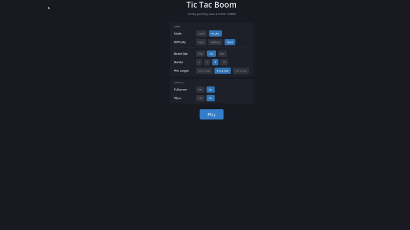

## Overview

It's Tic Tac Toe, but the board is destructible. And you destroy the board with bombs. Tic Tac Bombs. But that was a stupid name so now it's Tic Tac Boom.

  

Thanks for coming to my Ted Talk™️

Made with love with Godot 💜

## Opening in Godot
1. Clone the repo
2. Select the directory as a project in Godot
3. ???
4. Enjoy reading my bad code and project setup

## Known Issues
- Yeah so there isn't a quit button at the moment, or a way to exit a game and return to the main menu without winning/losing
- The animations are pretty basic, and in general the art is all pretty simple
- The resolution options don't play nice with multiple displays at all, I'm working on this
- If X and O both win following a bomb exploding, the player who placed the bomb will be awarded the win, instead of the game detecting a draw. This will still be fixed
- The CPUs are really stupid and easy to abuse. Please be nice to them they are trying their best and will be better soon
- The executable files don't have a logo so it defaults to the Godot logo. This is because I haven't made a logo yet
- There's no macOS build because I don't have access to a macOS device to export the game on. Sorry macOS users that want to play this game, all 0 of you must be very upset
- "Why is there a vsync option?" and other hilarious questions I won't be answering.
